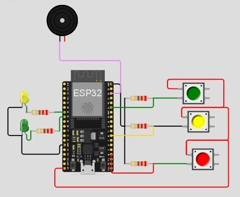

   
  <h1>Minigame Passa ou Repassa com Música</h1>

 

<table>
  <tr>
    <td>
      

        <table>
          <tr>
            <th>Alunos:</th>
          </tr>
          <tr>
            <th>Beatriz Dantas Sampaio</th>
          </tr>
          <tr>
            <th>Giovanna Franco Gaudino Rodrigues</th>
          </tr>
          <tr>
            <th>Isabela Barcellos Freire</th>
          </tr>
        </table>
      

    </td>
    <td>
      

        <b>Sprint 3   Edge Computing & Computer Systems</b>
      <td> <b>Objetivo →   Proporcionar para as crianças no ICr uma experiência mais confortável e única </b> </td>
      

    </td>
  </tr>
</table>

<b> - Tabela com o hardware do circuito </b>

| Quantidade | Descrição                     |
| ---------- | ----------------------------- |
| 1          | ESP32                         |
| 1          | Vermelho LED                  |
| 1          | Amarelo LED                   |
| 1          | Verde LED                     |
| 5          | 220 Ω Resistor                |
| 3          | Pushbutton                    |
| 1          | Buzzer                        |

<h2> Configuração </h2>

Conecte os componentes elétricos de forma adequada, caso tenha dúvidas, consulte o vídeo  abaixo:
<a href="ExplicaçãoEdge.mp4"> Vídeo circuito </a>

<h2> Código do Circuito </h2>

No Wokwi, ou outra plataforma com apoio ao Arduino Uno de sua escolha, copie e cole o seguinte código para testes:
<a href="código.c++"> Código </a>

<h2> Software </h2>

 Para o desenvolvimento do projeto, foi usado a IDE: 

1. <a href="https://wokwi.com/"> Wokwi </a>
2. <a href="https://tago.io/"> Tago </a>
2. <a href="https://www.hivemq.com/demos/websocket-client/"> Tago </a>

<h2> Link do Projeto Principal no Wokwi </h2>
<a href="https://wokwi.com/projects/398691556513530881"> Clique Aqui! </a>

<h2> Funcionamento  </h2>
1. Conecte os sensores e LEDs conforme o esquema.  
2. Conecte o ESP32.  
3. Carregue o código no Arduino usando a IDE.  
4. Observe as luzes dos LEDs e o som do buzzer.  
5. Verifique as informações sendo enviadas para a Tago ou HiveMQ

 

⚠️ <b> Caso você use outras entradas para os componentes, favor lembrar de atualizar seu código com as entradas corretas. </b>
